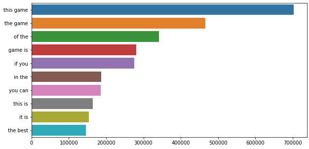
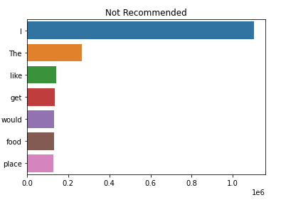
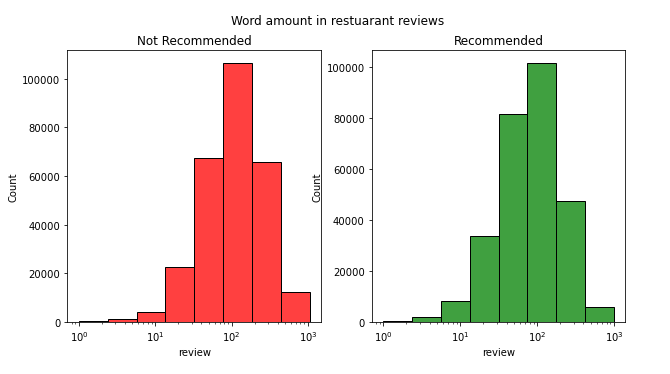
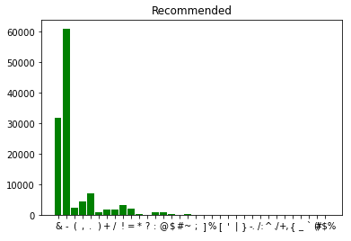
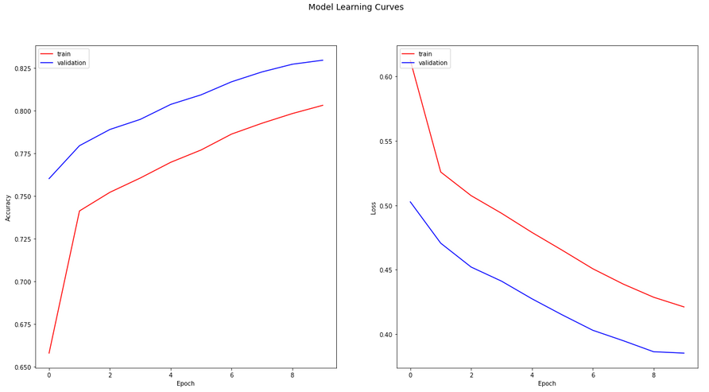

# Online-reviews-sentiment-about-a-topic

# Project Title

* **One Sentence Summary**:This repository holds an attempt to assist user to predict an ondemand positive and negative ratio of reviews with the help of data collected from the desired sites and applying deep leanring model on them.  

## Overview

  * **Definition of the tasks / challenge**  
  * The task, as defined by the kaggle challenges is to use BERT Model and GloVe model to predict the reviews' sentiment. 
  * **Your approach**
  * The approach in this repository is to use both model for same dataset and compare the perfomance of the two model and use the best model of the two for prediction. 
  * For example: GloVe might works best for one dataset and BERT model might works best for the other dataset. 
  * **Summary of the performance achieved** GloVe was achieved able to achieved 79% accuracy while BERT model is still in the training phase.

## Summary of Workdone

Step1: Take user input for name of the product and input for the platform/website
      For ex: Name of the product: counter strike, Platform/website: steam 
Step2: Create the test dateset via webscraping
Step3: Use the best trained model to predict the test dataset

### Data

* Data(for training):
  * Type: For example
    * Input for Steam:2GB csv file, 9.5 Million data points, contains 2 features i.e. review(as text) and target value(0 or 1)
    * Input for Yelp: 410mb csv file,560,000 data points, contains 2 features i.e. review(as text) and target value(0 or 1)  .
  * Size: How much data?
  * Instances (Train, Test, Validation Split): how many data points? Ex: 80% data points for training, 20% data points for testing, none for validation

#### Preprocessing / Clean up

manipulations performed to the data:
Removed urls, emojis, html tags and punctuations,
Tokenized the tweet base texts,
Lower cased clean text,
Removed stopwords,
Applied part of speech tags,
Converted part of speeches to wordnet format,
Applying word lemmatizer,
Converted tokenized text to string again.

#### Data Visualization

### Problem Formulation

* Define: Predict the review sentiment
  * Input / Output: text data as input / ratio of positive and negative ratio 
  * Models
    * Describe the different models you tried and why.
    * GloVe model: stands for Gloval Vectors for Word Representation
    * BERT model: stands for Bidirectional Encoder Representations from Transformers
  * Loss, Optimizer, other Hyperparameters.
  * GLoVe Model: binary_crossentropy loss function, Adam optimizer
  * Bert Model: AdamW Optimizer, 

### Training

* Describe the training:
  * How you trained: software and hardware.
    Local computer
  * How long did training take.
    Training took at least 1 hour
  * Training curves (loss vs epoch for test/train).
    The loss decreases as the epoch increases for the training dataset
  * How did you decide to stop training.
    After 10 epochs after no improvement in accuracy score
  * Any difficulties? How did you resolve them?
    Model takes to much time to load.
  

### Performance Comparison

* Accuracy matrix is used as the key performance metric(s).
* Training accuracy of more than 79% was obtained for GloVe model and Bert model being computationally intesive is still in the training phase.
* Show one (or few) visualization(s) of results, for example ROC curves.

### Conclusions

* Good enough accuracy is obtained from GloVe model which can be used for the prediction of test dataset.

### Future Work
* In future, we will create a new python file that takes the input from the user regarding the product and search the product in the platform and scrape reveiw out of it and gives review ratio on one go. 
* Similarly, additional platform/websites can be added such as movie from IMDB

### Overview of files in repository

* Resturant: contains two deep leaning model with training and testing
* Webscraping: contains two platform to scrape the data from which are Yelp and Steam
* Assets: contains images of preprocessing and cleaning from Cleaning files
* Cleaning: contains preprocessing and cleaning steps

### Software Setup
* keras, scikit learn, NLTK are the important packages used
* These packages can be installed using the command : pip install package_name

### Data

* Training data can be downloaded from kaggle with these link.
* https://www.kaggle.com/code/datafan07/disaster-tweets-nlp-eda-bert-with-transformers#Building-the-Bert-Model
* https://www.kaggle.com/code/shahules/basic-eda-cleaning-and-glove#Data-Cleaning

* Lead them through preprocessing steps, if necessary.

### Training

* GloVe model can be trained on local computer. However, BERT Model being too computationally intensive is difficult to train on local computer. 

## Citations

* Provide any references.
https://www.kaggle.com/code/datafan07/disaster-tweets-nlp-eda-bert-with-transformers#Building-the-Bert-Model
https://www.kaggle.com/code/shahules/basic-eda-cleaning-and-glove#Data-Cleaning

